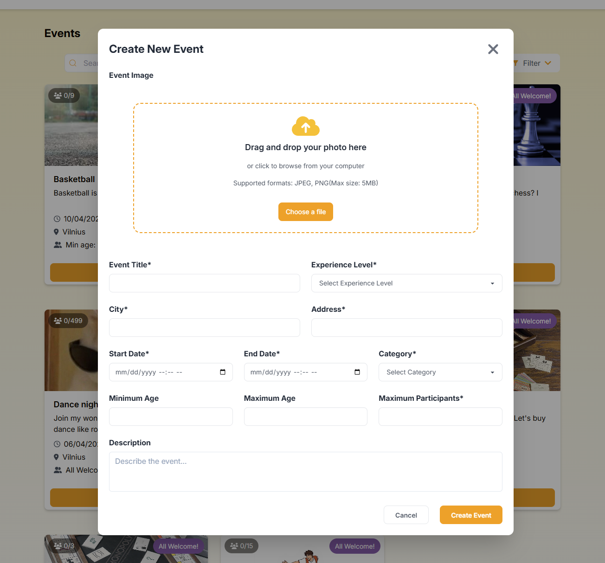
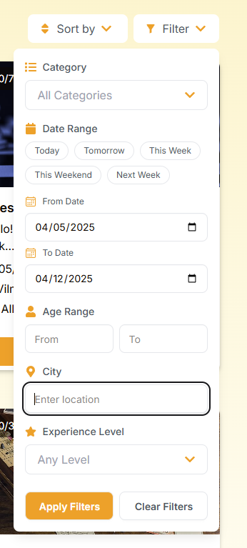
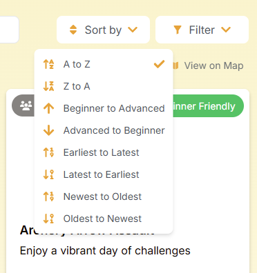
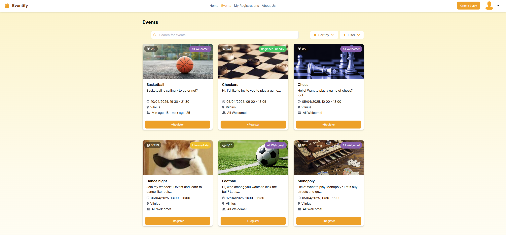
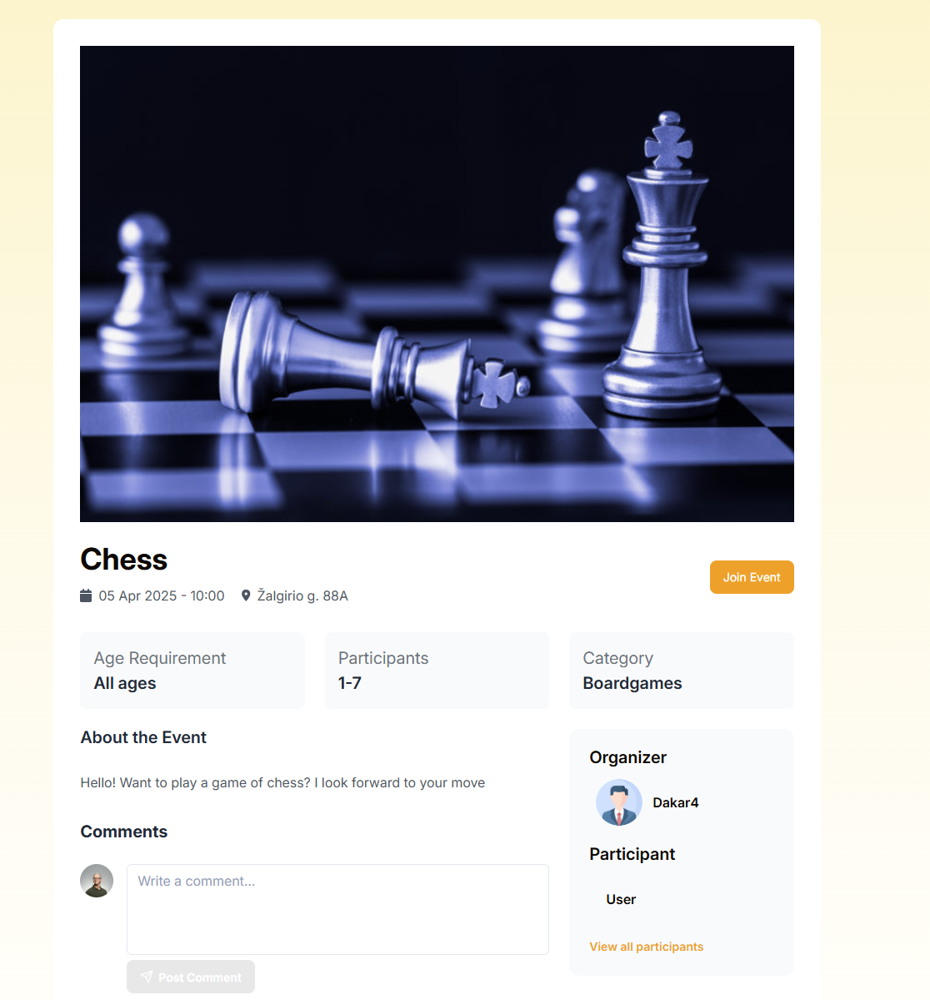

# Eventify

## About 

Eventify is a social media website that allows users to create events, join each others events, message with one another in real-time and leave reviews. The website aims to create an engaging environment where users can interact with one another and host or join events - just choose a category, fill out the necessary information and your event is ready to go, waiting for others to join.
The project is made by team LDK.


## Features

* Event Creation: Create and customize your own events with details like location, time, category and description



* Event Discovery: Browse and filter events by category,date range, location and experience level

<div style="display: flex; gap: 50px">


</div>

* Real-time Messaging: Chat with event hosts and attendees
* User Profiles: Customize your profile with a photo and bio
* Reviews & Ratings: Leave feedback on event organizers and attendees.


<div></div>


## Technologies Used

### Frontend - Javascript
* React + Vite
* TailwindCss
* DaisyUI
* React Hook Forms
* React Routes
* Websockets & Stomp
* SockJs
* Prettier and ESLint
* Axios
* Other notable libraries - Date-fns(date formatting), JWT-decode(token decoder), Dropzone(file dropzone), Lucide(icons), Slick(carousel)

### Backend - Java
* Spring Boot
* Maven
* Spring Web
* MySQL & MongoDb Connectors
* Jakarta Persistence API
* OAuth2 Resource Server
* Spring Security
* Spring Validation
* Junit Jupiter
* Websocket & Stomp
* SockJs Client
* Lombok
* Query DSL
* Swagger

### Databases 
* MySQL - used for user information and events
* MongoDB - used for user statuses and messages

### Installation

#### Requirements
* Node.js (v16.0 or later recommended)
* Java Development Kit (JDK 11 or later)
* Maven
* Docker (for database setup)

#### Frontend Setup
```
# Clone the repository
git clone https://github.com/AusteId/eventify.git
# Navigate to the project directory
cd eventify
# Install dependencies
npm install
# Set up environment variables
cp .env.dev .env
# Start the development server
npm run dev
```
#### Backend Setup
* Use an IDE of your choice (like Eclipse or IntelliJ IDEA) and simply launch the application.
* Alternatively, if you do not have an IDE, you can run it through terminal being inside the folder that contains pom.xml file:

```
# Compile the application
mvn clean install

# Run the application
mvn spring-boot:run
```

#### Databases Setup - Desktop Docker
* Once desktop docker is active and running, paste the two following commands in the terminal (Do not forget to change password and username or just use defaults (username root, password YOUR-PASSWORD-GOES-HERE, http://localhost:8081))
```
docker run --name some-mysql -e MYSQL_ROOT_PASSWORD=YOUR-PASSWORD-GOES-HERE -d -p 3306:3306 mysql:8.0
```
```
docker run --name phpmyadmin -d --link some-mysql:db -p 8081:80 phpMyAdmin
```
* For more detailed MongoDB setup instructions, refer to the [official documentation](https://www.mongodb.com/docs/manual/tutorial/install-mongodb-community-with-docker/).
* In summary, download MongoDB shell, (optional) MongoDb Compass in case you want to see what happens inside the database. Pull the container using command below
```
docker pull mongodb/mongodb-community-server:latest
```
Then run the image as a container
```
docker run --name mongodb -p 27017:27017 -d mongodb/mongodb-community-server:latest
```

### Usage
After installation, you can use Eventify as follows:
1. Creating an Account: Register with your email and password
2. Browsing Events: Explore the available events using filters in the events page
3. Creating Event: Click the "Create Event" button to set up your own event with
4. Joining Event: Find the event you like and the click register to join the event as a participant
5. Messaging: Click on the dropdown next to the profile picture and choose messages, find the person you are looking for and message them your questions directly.
6. Reviews: After attending an event, leave a review to share your experience

### API Documentation
Our API follows RESTful principles and is secured using OAuth2 and JWT tokens
Endpoints are avalaible in Swagger the link for it is http://localhost:8080/swagger-ui/index.html when you run the app.
